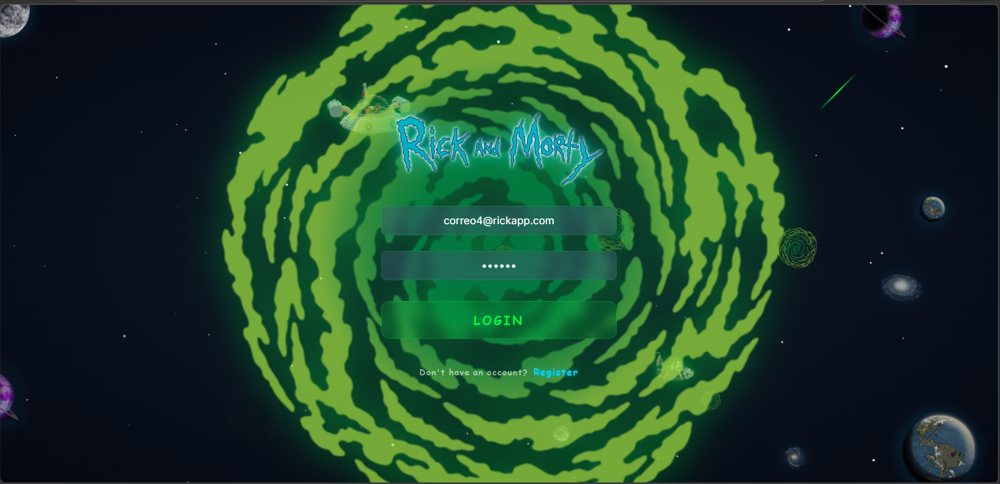
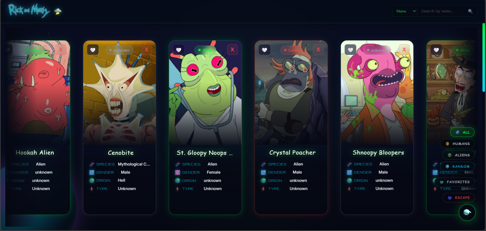
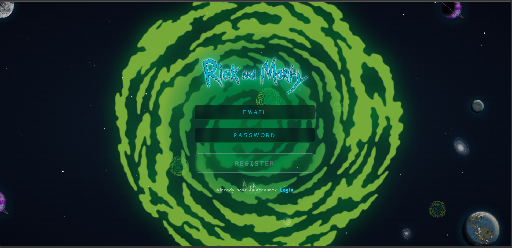
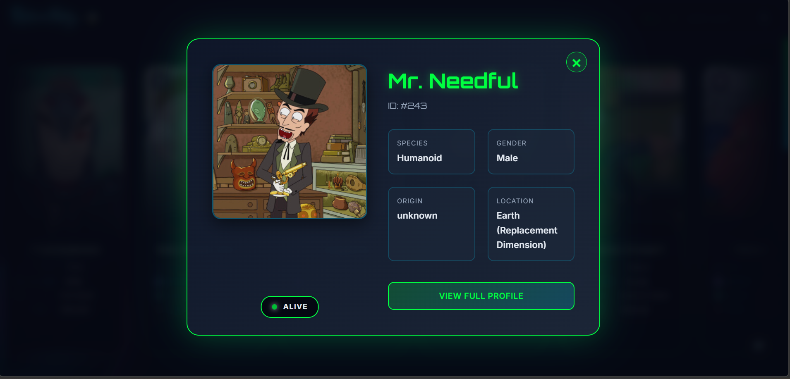

# 🛸 Rick & Morty Character Hub: Explorador del Multiverso

Una Aplicación Full-Stack de Alto Rendimiento diseñada para explorar el multiverso de Rick & Morty mediante búsqueda avanzada, autenticación real con JWT, gestión de favoritos persistida en la nube y una UI premium con estética neón/espacial en el ecosistema React moderno.

<p align="center">
  
</p>
<p align="center">
  
</p>

🚀 **Despliegue (Live Demo)**
Puedes ver la aplicación funcionando aquí: [Ver Demo](https://rick-morty-character-hub.vercel.app)

⚡ **Stack en Producción:**
*   **Frontend:** SPA React + Vite desplegada globalmente en [Vercel](https://rick-morty-character-hub.vercel.app).
*   **Backend:** API REST Node/Express desplegada en [Railway](https://rick-morty-character-hub-production.up.railway.app).
*   **Base de Datos:** MongoDB Atlas (cloud) para persistencia de usuarios y favoritos.

Consume la **Rick and Morty API** pública en tiempo real para traer los +800 personajes del multiverso.
Regístrate, inicia sesión y guarda tus favoritos — persisten en la nube entre sesiones. ⚡

---

## 🔐 Autenticación Real con JWT: Sistema de Identidad del Explorador
<p align="center">
  
</p>

El punto de entrada de la aplicación es su sistema de autenticación real con JWT, construido sobre un backend Node/Express con base de datos MongoDB en la nube.

*   **JWT + bcryptjs:** Los tokens de acceso se firman con JWT y las contraseñas se hashean con bcryptjs antes de persistirse en MongoDB — sin texto plano en ningún punto del flujo.
*   **Persistencia en MongoDB Atlas:** Los usuarios registrados y sus favoritos se almacenan en la nube, disponibles desde cualquier dispositivo y sesión.
*   **Interceptor de Axios:** Cada request al backend adjunta automáticamente el JWT via header `Authorization: Bearer`, centralizando la lógica de autenticación en un único punto.
*   **Validación de Formularios:** Lógica de validación de campos en tiempo real con feedback visual inmediato antes de procesar cualquier acción.
*   **Guards de Ruta:** Las rutas protegidas verifican el estado de autenticación antes de renderizar, redirigiendo automáticamente al Login si no hay sesión activa.
*   **UX de Onboarding:** Pantalla de bienvenida temática que introduce al usuario al universo de la app antes de acceder al explorador principal.

---

## 🛠️ Architecture Insights: Redux + Backend para Estado Global de Favoritos
Para gestionar la colección de favoritos del usuario a través de múltiples rutas, componentes y sesiones, se implementó Redux como capa de estado global sincronizada con un backend Node/Express + MongoDB, logrando persistencia real en la nube.

*   **Store Centralizado:** El mazo de favoritos vive en un único store Redux accesible desde cualquier componente, eliminando prop drilling entre la galería, el detalle y la vista de favoritos.
*   **Acciones Atómicas:** `ADD_FAVORITE` y `REMOVE_FAVORITE` como acciones puras y predecibles que garantizan que el estado nunca mute de forma inesperada.
*   **Persistencia Real en la Nube:** Los favoritos se sincronizan con MongoDB Atlas al agregar o remover — sobreviven recargas, cierres de sesión y cambios de dispositivo.
*   **API REST de Favoritos:** Endpoints protegidos por JWT en el backend que validan la identidad del usuario antes de leer o escribir su colección en la base de datos.
*   **Decisión Arquitectónica Consciente:** Redux gestiona el estado local optimista (UI instantánea), mientras el backend actúa como fuente de verdad persistente — el mismo patrón usado en aplicaciones de producción a escala.

---

## ✨ High-Fidelity UX/UI & Features
<p align="center">
  
</p>

*   **Glassmorphism & Estética Neón/Espacial:** UI 100% customizada con transparencias, `backdrop-filter`, bordes luminosos y paleta de colores psicodélica inspirada en el universo del show.
*   **Búsqueda Multidimensional:** Soporte para búsqueda por ID directo, nombre, especie y status — cada modalidad consume el endpoint correcto de la API para máxima precisión.
*   **Filtrado Rápido:** Filtros integrados para separar Humanos de Alienígenas en tiempo real sin nueva llamada a la API.
*   **Vista de Detalle Expandida:** Modal con información completa del personaje: origen, ubicación actual, status de vida y lista de episodios en los que aparece.
*   **Gestión de Favoritos:** Colección persistente en MongoDB con opción de agregar/remover personajes desde la galería o desde el detalle — disponible en cualquier sesión y dispositivo.

<p align="center">
  
</p>

---

## 🛡️ Robustez y Resiliencia
Diseñado para manejar los límites y errores del multiverso con elegancia.

*   **Estados de Carga (Loaders):** Indicadores visuales mientras la API responde, evitando interfaces vacías o confusas durante el fetching.
*   **Placeholders de Datos:** Cuando la información de un campo no está disponible en la API, se muestran valores por defecto temáticos en lugar de `undefined` o errores visuales.
*   **Validación Pre-Submit:** Los formularios de autenticación validan todos los campos antes de procesar, previniendo estados inválidos en el store.
*   **CORS Configurado:** El backend gestiona correctamente las políticas de cross-origin entre el frontend en Vercel y la API en Railway, incluyendo manejo de preflight `OPTIONS`.

---

## 🚀 Roadmap Evolutivo
### ✅ Características Clave (Completadas):
*   Sistema de Autenticación Real con JWT + bcryptjs + MongoDB Atlas.
*   API REST Node/Express desplegada en Railway con CORS configurado.
*   Explorador de personajes con búsqueda multidimensional.
*   Gestión de Favoritos con Redux + persistencia real en MongoDB por usuario.
*   Vista de Detalle expandida con episodios y localizaciones.
*   UI Premium con Glassmorphism y estética neón/espacial.
*   Monorepo en GitHub con deploys automáticos en Vercel (frontend) y Railway (backend).

### 🔮 Próximos Pasos (En Desarrollo):
*   📜 **Infinite Scrolling:** Paginación continua para explorar los +800 personajes del multiverso sin sobrecargar el DOM, usando Intersection Observer.
*   🔔 **Sistema de Notificaciones (Toasts):** Migración de `window.alert` a notificaciones temáticas premium con React-Hot-Toast.
*   🔍 **Búsqueda Avanzada Combinada:** Formulario multicampo que permita combinar filtros simultáneos (ej: "Aliens que estén vivos en la Ciudadela de Ricks").
*   📊 **Stats de la Colección:** Gráficos en la sección de favoritos mostrando distribución por especie, status y origen.

---

## ⚙️ Instalación y Despliegue Local
Sigue estos pasos para correr el proyecto localmente. Necesitarás tener Node.js instalado.

### 1. Clonar el repositorio
```bash
git clone https://github.com/barockatr/Rick-Morty-Character-Hub.git
cd Rick-Morty-Character-Hub
```

### 2. Configurar y levantar el Backend
```bash
cd backend
npm install
```
Crea un archivo `.env` en `backend/` con las siguientes variables:
```env
MONGO_URI=tu_mongodb_atlas_uri
JWT_SECRET=tu_secreto_jwt
PORT=3001
```
```bash
npm run dev
```
El backend estará disponible en `http://localhost:3001` 🚀

### 3. Configurar y levantar el Frontend
```bash
cd App-Rick-Morty
npm install
```
Crea un archivo `.env` en `App-Rick-Morty/` con la siguiente variable:
```env
VITE_API_URL=http://localhost:3001/api
```
```bash
npm run dev
```
La aplicación estará disponible en `http://localhost:5173` 🚀

---

**Nota:** La app consume la Rick and Morty API pública para los personajes. Para auth y favoritos requiere el backend corriendo con MongoDB Atlas configurado.

Desarrollado para demostrar dominio de arquitecturas Full-Stack modernas: React + Redux en el cliente, Node/Express + JWT en el servidor, y MongoDB Atlas como capa de persistencia en la nube.
